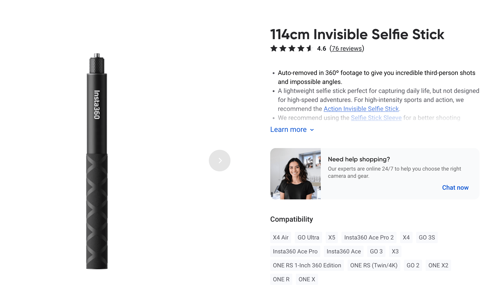
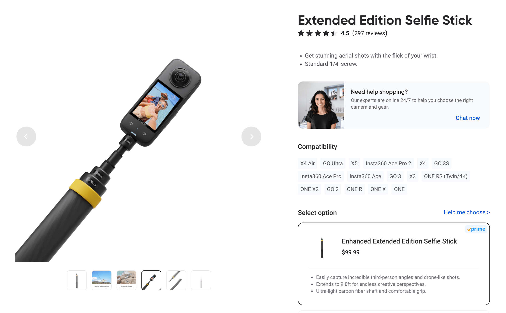
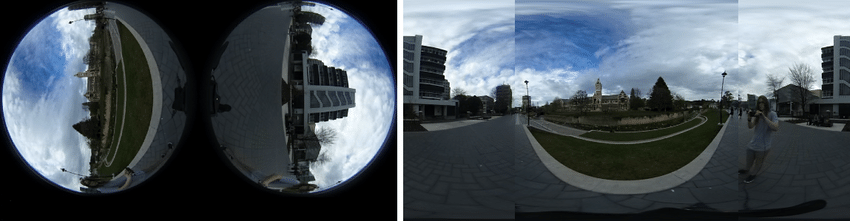

# Chapter 0: Capturing 360 Photos

> Hands-on portion — we'll head outside with an Insta360 X4 to capture 360° photos around the Media Lab.

## Equipment

### Camera: Insta360 X4

The [**Insta360 X4**](https://store.insta360.com/product/x4) is a dual-lens 360° camera capable of 8K video and 72 MP photos. It's a solid, well-rounded option for 360 capture.

Since the newer **X5** is now the latest model (and uses the same 1/2" sensor), the **X4 is available at a lower price point — around $500 on the [official Insta360 store](https://store.insta360.com/product/x4)**, making it a great value pick for getting started.

### Selfie Sticks (Invisible in 360)

Because a 360 camera's two lenses face opposite directions, any stick mounted directly below the camera sits right on the **stitch line** — and gets erased in the final image. This gives you a floating-camera effect with no visible support.

Insta360 makes two options:

| Stick                             | Length          | Price | Link                                                                               |
| --------------------------------- | --------------- | ----- | ---------------------------------------------------------------------------------- |
| **114cm Invisible Selfie Stick**  | 114 cm (3.7 ft) | ~$16  | [Insta360 Store](https://store.insta360.com/product/selfie_stick)                  |
| **Extended Edition Selfie Stick** | 3 m (9.8 ft)    | ~$100 | [Insta360 Store](https://store.insta360.com/product/Extended_Edition_Selfie_Stick) |

<table>
<tr>
<td width="50%"></td>
<td width="50%"></td>
</tr>
<tr>
<td align="center">114cm Invisible Selfie Stick</td>
<td align="center">Extended Edition Selfie Stick (3m / 10ft)</td>
</tr>
</table>

> **The extended stick is a must-have** for environment scanning workflows (Chapter 1). Raising the camera to ~3 meters gives you a dramatically higher vantage point — closer to overhead — which captures the ground plane, room layouts, and spatial relationships far more completely than a head-height shot. For any application that feeds into 3D reconstruction or spatial understanding, that extra elevation makes a real difference.

## How a 360 Camera Works

The Insta360 X4 has **two fisheye lenses** pointing in opposite directions. Each lens captures slightly more than a hemisphere. The camera (or its desktop software) **stitches** these two fisheye images into a single **equirectangular** image.

Image credit: Caracotte, Morbidi & Mouaddib, "Photometric Stereo with Twin-Fisheye Cameras," _ICPR 2020_ — [ResearchGate](https://www.researchgate.net/figure/An-example-of-the-360-images-we-obtain-from-the-Ricoh-camera-Left-The-raw_fig7_331104134). Shown here is a Ricoh Theta V capture.

### Why Is the Raw File Stored as Dual Fisheye?

When the camera captures a shot, what each lens _actually_ records is a circular fisheye image — that's the native optical output. The camera saves these **two fisheye circles side by side** as the raw file (`.insp` on Insta360, or a similar format on other cameras like the Ricoh Theta).

There are good reasons to keep this raw representation:

- **Lossless original** — stitching into equirectangular is a resampling/warping step that destroys some information. Keeping the raw fisheye means you can re-stitch later with better algorithms, different horizon correction, or updated calibration.
- **Calibration flexibility** — the exact stitch depends on lens alignment, which can vary slightly between units or even sessions. Raw files let you recalibrate.
- **Smaller file** — the two fisheye circles occupy less pixel area than a full equirectangular image (the black corners are ignored), so the raw file is more storage-efficient.

### What Is Equirectangular Projection?

Equirectangular is the standard format for 360° images:

- **2:1 aspect ratio** — the full 360° horizontal × 180° vertical field of view is mapped onto a flat rectangle
- Same projection family as the **plate carrée** world map: longitude maps to the x-axis, latitude to the y-axis, both at uniform spacing
- This is the format used by Google Street View, Facebook 360, and virtually all panorama viewers

### Resolution Distribution in Equirectangular Images

One important property of equirectangular projection: **resolution is not evenly distributed across the sphere.**

In the equirectangular rectangle, every row of pixels spans the same image width — but on the actual sphere, the rows near the poles cover _much less physical area_ than the rows at the equator. This means:

- **The poles (top and bottom) are heavily oversampled** — the north and south poles of the sphere, which are just single points, get stretched across the entire width of the image. This is wasted resolution.
- **The equator (middle) has the most efficient use of pixels** — one pixel in the middle row of the image covers the smallest angular area on the sphere, so this is where you get the sharpest detail.
- **In practice**, for an equirectangular image of W×H resolution, the **effective angular resolution at the equator** is W pixels / 360° ≈ the "true" horizontal density, while the poles are massively oversampled relative to their angular area.

This is analogous to a [Mercator map](https://en.wikipedia.org/wiki/Mercator_projection) making Greenland look as large as Africa — the poles are stretched. For 360 cameras this typically means the zenith (straight up = sky) and nadir (straight down = ground / tripod) have far more pixels than they need, while the horizon band — where most of the interesting content is — uses pixels most efficiently.

> **Practical implication:** when splitting an equirectangular panorama into perspective views for computer vision (the core technique of this workshop), the perspective crops naturally undo this distortion — each crop has uniform angular resolution, just like a normal photo.

## Camera Settings

| Setting               | Recommendation       | Notes                                                    |
| --------------------- | -------------------- | -------------------------------------------------------- |
| **Mode**              | Photo (72MP / 8K)    | Maximum detail for post-processing                       |
| **Exposure**          | Auto                 | Works well outdoors; consider manual for tricky lighting |
| **HDR**               | On for static scenes | Improves dynamic range but requires holding still        |
| **Interval shooting** | 1–2 sec intervals    | Essential for 3D scanning walks (Chapter 1)              |
| **File format**       | Default (.insp)      | Proprietary dual-fisheye; we convert later               |

### Tips for Good Captures

- **Hold the stick vertical** — tilt causes the stitch line to shift, creating artifacts
- **Walk slowly** when doing interval captures for 3D scanning
- **Avoid reflective surfaces** close to the camera — mirrors and glass confuse the stitching
- **Mind the stitch line** — objects right at the seam between the two lenses may show artifacts
- The selfie stick holder's **arm** may appear if it extends past the stitch line

## Post-Capture: Insta360 Studio

The raw files from the camera (`.insp` for photos, `.insv` for video) are in Insta360's proprietary dual-fisheye format. You need **Insta360 Studio** (free desktop app) to convert them.

**Download:** [Insta360 Studio](https://www.insta360.com/download/insta360-x4)

### Conversion Workflow

1. **Import** — drag `.insp` / `.insv` files into Insta360 Studio
2. **Horizon correction** — enable FlowState stabilization to level the horizon. This is important: a tilted horizon breaks downstream processing.
3. **Export** — choose **Equirectangular** projection, export as JPEG (photos) or MP4 (video)
4. **Batch export** — select multiple files and export at once (no quantity limit)

### Output

After export, you'll have standard equirectangular JPEGs (typically 5888×2944 or larger) that work with any panorama viewer or processing tool.

These are the files we'll use in all subsequent chapters.

---

**Next:** [Chapter 1 — 3D Scanning from 360](../01-3d-scanning/)
