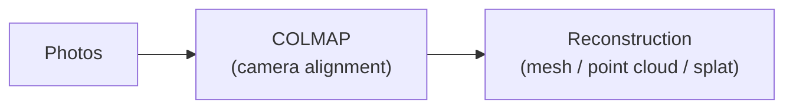
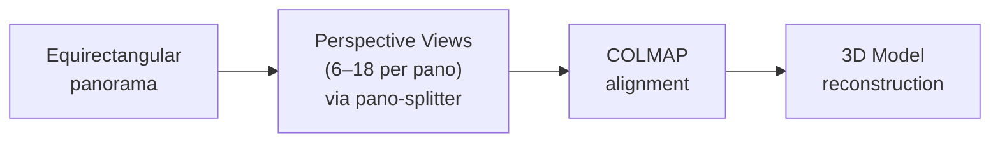

# Chapter 1: 3D Scanning from 360 Photos

> Use panoramic images for 3D reconstruction — photogrammetry and gaussian splatting.

## Why Use 360 for 3D Scanning?

- **Tight spaces** — when you can't easily maneuver a regular camera (small rooms, hallways, cluttered environments), a 360 camera captures everything in one shot
- **Speed over quality** — capturing is more important than per-shot quality for environment scans. Walk through a space with interval shooting and you're done.
- **Omnidirectional coverage** — every shot covers the full sphere, so you need far fewer images to cover a scene than with a regular camera
- **Great for environment scans** — interiors, streetscapes, outdoor spaces

## The Challenge

Most 3D reconstruction pipelines expect **perspective camera images** (the kind a regular phone or DSLR produces). They don't know what to do with equirectangular panoramas.

The standard reconstruction pipeline looks like:



COLMAP — the most widely used structure-from-motion tool — does **not** support equirectangular/spherical camera models. Its supported camera types are all pinhole-family or fisheye models. This is a fundamental limitation in COLMAP's camera model definitions.

### The Exception: Agisoft Metashape

**[Agisoft Metashape](https://www.agisoft.com/)** (cross-platform, paid) is the only major reconstruction tool that natively supports the **spherical camera model**. You can import equirectangular images directly and it will handle the projection correctly.

However, even Metashape cannot export camera parameters in COLMAP format while preserving the spherical model — because COLMAP simply doesn't have that model type. So if your downstream pipeline needs COLMAP data, you're back to the split approach.

## The Solution: Split, Then Reconstruct

The workaround is straightforward: **chop each panorama into multiple perspective views**, then feed those into any standard reconstruction pipeline.




### Pano Splitter

[**pano-splitter**](https://github.com/yz3440/pano-splitter) is a tool for exactly this — converting equirectangular images to perspective views with configurable angles and parallel processing.

```bash
# Clone the tool
git clone https://github.com/yz3440/pano-splitter.git
cd pano-splitter

# Install dependencies
uv sync  # or: pip install -r requirements.txt

# Split a batch of panoramas into perspective views
python pano_splitter.py \
    --input_path ./my_panoramas \
    --output_path ./perspective_views \
    --list-of-pitch 60 90 120 \
    --list-of-yaw 0 60 120 180 240 300 \
    --FOV 90 \
    --output_format jpg
```

**Key options:**
- `--list-of-pitch` — vertical angles (60°=looking up, 90°=horizon, 120°=looking down)
- `--list-of-yaw` — horizontal angles (0°=front, 90°=right, 180°=back, 270°=left)
- `--FOV` — field of view per perspective image (default 90°)
- `--max-workers` — number of parallel threads

For a single image, use `single_pano_splitter.py` instead.

## Reconstruction Software

Once you have perspective views, choose your reconstruction method:

### Online (Easiest)

- **[Polycam](https://poly.cam)** — upload photos, get a 3D model back. Supports gaussian splats and meshes. Free tier available.

### Gaussian Splatting

- **[Postshot](https://postshot.app/)** (Windows) — GUI-based gaussian splatting. Import photos, get a splat.
- **[gsplat](https://github.com/nerfstudio-project/gsplat) / [Nerfstudio](https://nerf.studio/)** (Python, cross-platform) — code-based pipelines. More control, more setup.

### Photogrammetry (Mesh / Point Cloud)

- **[RealityCapture](https://www.capturingreality.com/)** (Windows, free via Epic Games) — fast, high-quality photogrammetry. Widely used in game dev and VFX.
- **[Agisoft Metashape](https://www.agisoft.com/)** (cross-platform, paid) — the only option that handles spherical cameras natively (no splitting needed).

## Project Reference: J Train Simulator


**[J Train Simulator](https://www.yufengzhao.com/)** is a gaussian splat 3D scan + soundscape of a J train stop in Brooklyn, NY. The entire scan was captured using 360° photos on a long selfie stick, shot from an apartment balcony. No drone was involved — just a consumer 360 camera on a very long stick, pointed down at the street below.

This demonstrates that 360 cameras can produce compelling 3D reconstructions even in situations where traditional capture methods (drones, walking around with a DSLR) aren't practical.

---

**Previous:** [Chapter 0 — Capturing 360 Photos](../00-capturing-360/) · **Next:** [Chapter 2 — OCR on 360 Images](../02-ocr-360/)

---

## Suggested Assets to Add

| Filename | Description |
|----------|-------------|
| `assets/pano-splitter-output.jpg` | Grid showing a panorama split into multiple perspective views |
| `assets/j-train-simulator.jpg` | Screenshot from the J Train Simulator project |
| `assets/reconstruction-comparison.jpg` | Side-by-side of source panorama vs. 3D reconstruction result |
| `assets/pipeline-diagram.png` | Visual diagram of the full pipeline (panorama → split → reconstruct) |
