# Chapter 1: 3D Scanning from 360 Photos

> Use panoramic images for 3D reconstruction — photogrammetry and gaussian splatting.

## Why Use 360 for 3D Scanning?

- **Tight spaces** — when you can't easily maneuver a regular camera (small rooms, hallways, cluttered environments), a 360 camera captures everything in one shot
- **Speed over quality** — capturing is more important than per-shot quality for environment scans. Walk through a space with interval shooting and you're done.
- **Omnidirectional coverage** — every shot covers the full sphere, so you need far fewer images to cover a scene than with a regular camera
- **Great for environment scans** — interiors, streetscapes, outdoor spaces

## The Challenge

Most 3D reconstruction pipelines expect **perspective camera images** (the kind a regular phone or DSLR produces). They don't know what to do with equirectangular panoramas.

The standard reconstruction pipeline looks like:

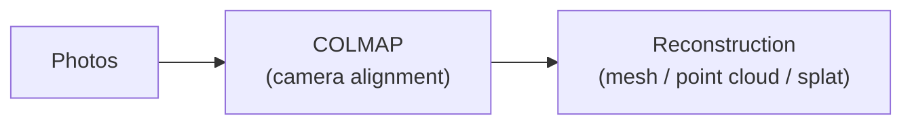

COLMAP — the most widely used structure-from-motion tool — does **not** have a true spherical camera model. While COLMAP 3.12 added some spherical camera support, [it internally uses a rig of virtual perspective cameras](https://github.com/colmap/colmap/issues/3595#issuecomment-3227298880) rather than a native equirectangular projection — and the spherical option isn't even available in the GUI yet.

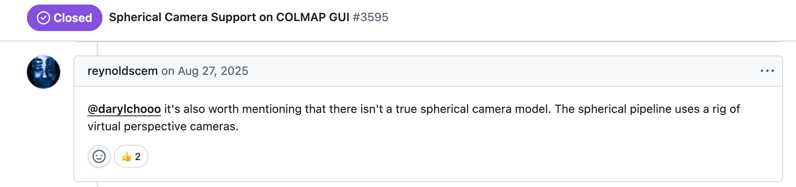

There are two ways around this:

1. **Use software that natively supports spherical cameras** — Agisoft Metashape is the only major tool that does
2. **Split the panoramas into perspective views** — then feed them into any standard pipeline (Polycam, Postshot, RealityCapture, etc.)

We'll walk through both approaches.

## Approach 1: Agisoft Metashape (Direct Import)

**[Agisoft Metashape](https://www.agisoft.com/)** (cross-platform, paid) is the only major reconstruction tool that natively supports the **spherical camera model**. You can import equirectangular images directly and it will handle the projection math correctly — no splitting needed.

### Step 1: Import Photos

Import the equirectangular JPEGs exported from Insta360 Studio ([Chapter 0](../00-capturing-360/)) into a new Metashape project. Go to **Workflow → Add Photos** and select all your images.

You should see them listed under **Chunk 1** in the Workspace panel, with "0/N aligned" status and the 2:1 equirectangular preview in the viewer.

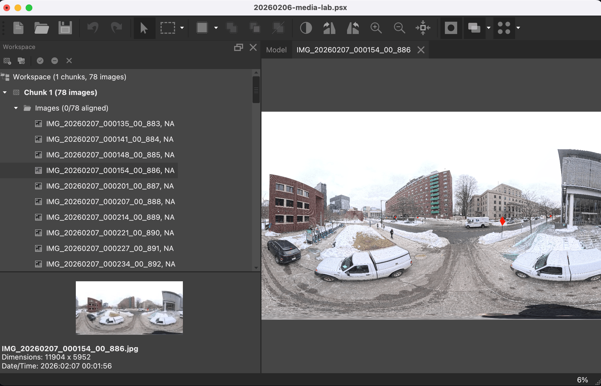

### Step 2: Set Camera Type to Spherical

By default, Metashape assumes a standard frame (pinhole) camera. Since our images are equirectangular panoramas, we need to tell Metashape to use the **spherical** camera model.

1. **Select all images** in the Workspace panel (click the image group or select all photos)
2. Go to **Tools → Camera → Camera Calibration...**

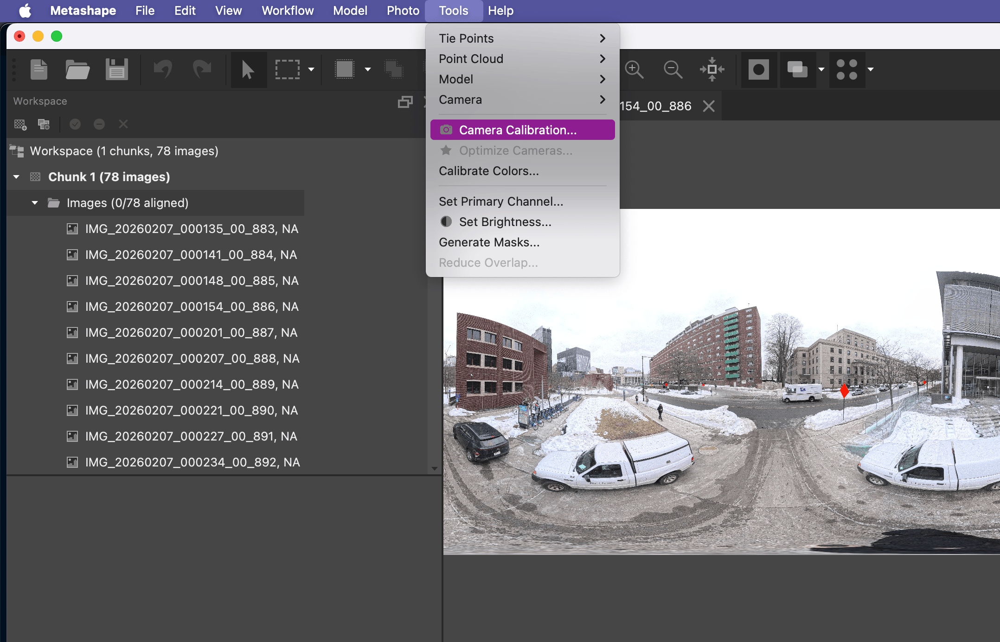

3. In the Camera Calibration dialog, click the **Camera type** dropdown (top-right) and change it from **Frame** to **Spherical**
4. Click **OK**

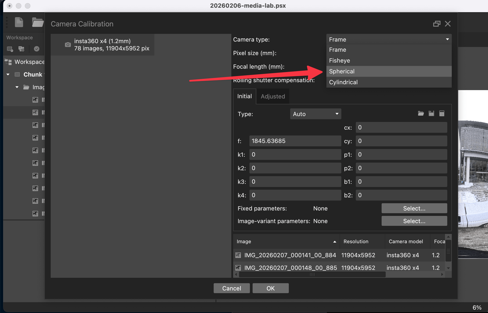

This tells Metashape that each image represents a full 360° × 180° sphere projected onto a flat rectangle — which is exactly what equirectangular means. Without this step, Metashape would try to interpret the images as regular pinhole photos and alignment would fail.

### Step 3: Align Cameras

Go to **Workflow → Align Photos**. Use the default settings (High accuracy is a good starting point) and run the alignment.

Metashape will find matching features across the panoramas and estimate camera positions. Because each image covers the full sphere, there's massive overlap between adjacent shots — alignment tends to be very robust, even with fewer images than you'd need with a regular camera.

After alignment, you'll see a **sparse point cloud** (65,801 tie points from our 78 images) and the estimated camera positions in the 3D viewport. Notice the camera positions form a line along Amherst St. — matching the path we walked during capture.

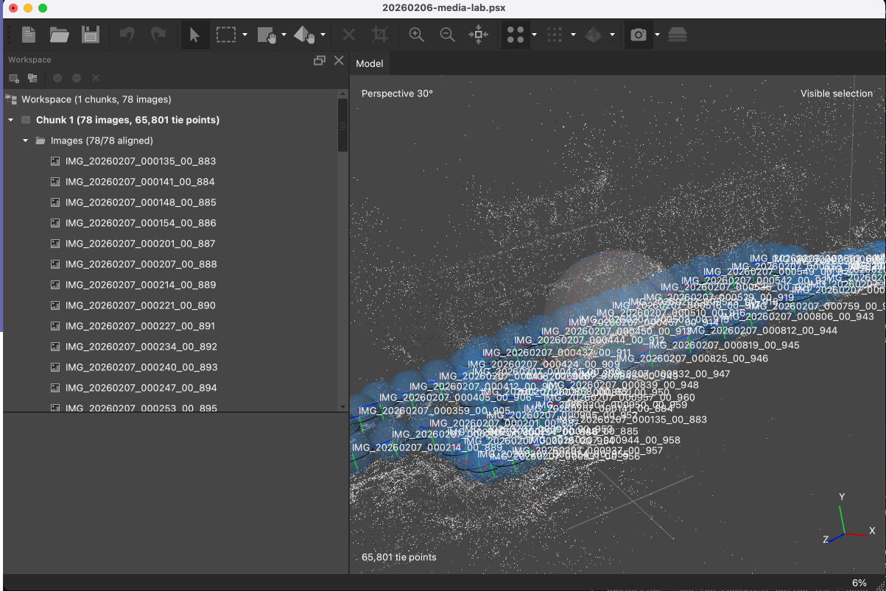

### Step 4: Build Mesh

Go to **Workflow → Build Mesh**. You can build from depth maps directly without generating a dense cloud first — this is faster and often sufficient for a workshop demo.

The result is a textured 3D mesh of the scene. Our 78-image set produced a mesh with 1,134,730 faces and 570,304 vertices — a detailed reconstruction of the street and surrounding buildings.

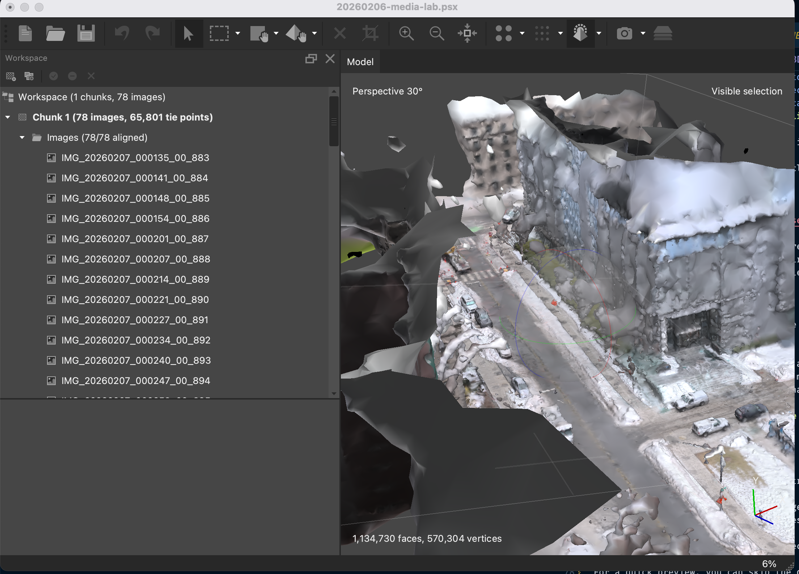

### Step 5: Build Texture

Go to **Workflow → Build Texture** to project the photo color data onto the mesh. This gives the model its photorealistic appearance.


> **Note:** Metashape cannot export camera parameters in COLMAP format while preserving the spherical model — because COLMAP simply doesn't have that model type. So if your downstream pipeline needs COLMAP data (e.g., for gaussian splatting with gsplat/Nerfstudio), you'll need the split approach below.

## Approach 2: Split, Then Reconstruct

The more universal approach: **chop each panorama into multiple perspective views**, then feed those into any standard reconstruction pipeline.

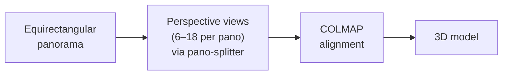

This works with every reconstruction tool, because the output is standard perspective images — indistinguishable from regular camera photos.

### Pano Splitter

[**pano-splitter**](https://github.com/yz3440/pano-splitter) is a tool for exactly this — converting equirectangular images to perspective views with configurable angles and parallel processing.

```bash
# Clone the tool
git clone https://github.com/yz3440/pano-splitter.git
cd pano-splitter

# Install dependencies
uv sync  # or: pip install -r requirements.txt

# Split a batch of panoramas into perspective views
python pano_splitter.py \
    --input_path ./my_panoramas \
    --output_path ./perspective_views \
    --list-of-pitch 60 90 120 \
    --list-of-yaw 0 60 120 180 240 300 \
    --FOV 90 \
    --output_format jpg
```

**Key options:**

- `--list-of-pitch` — vertical angles (60°=looking up, 90°=horizon, 120°=looking down)
- `--list-of-yaw` — horizontal angles (0°=front, 90°=right, 180°=back, 270°=left)
- `--FOV` — field of view per perspective image (default 90°)
- `--max-workers` — number of parallel threads

For a single image, use `single_pano_splitter.py` instead.

Pano Splitter also has a **GUI**. The ideal configuration depends on how many images your reconstruction tool can accept.

**Ideal config — 18 views per panorama:**

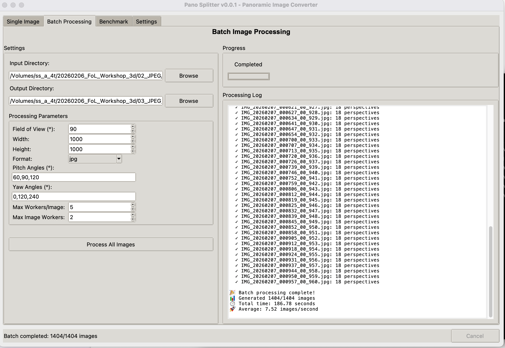

- **Field of View:** 90° — each output image covers a 90° cone, like a standard wide-angle lens
- **Pitch Angles:** 60°, 90°, 120° — three vertical tiers: looking up (60°), straight ahead (90°), and looking down (120°)
- **Yaw Angles:** 0°, 60°, 120°, 180°, 240°, 300° — six evenly spaced directions around the horizon (every 60°)
- **Width / Height:** 1000 × 1000

This gives **18 perspective views per panorama** with maximum spherical coverage. For 78 panoramas that's **1,404 images** — the log confirms all 1,404 were generated in about 187 seconds. This is the config you'd want for offline tools like RealityCapture, Postshot, or Nerfstudio that don't have upload limits.

**Compromise config — 3 views per panorama (for Polycam):**

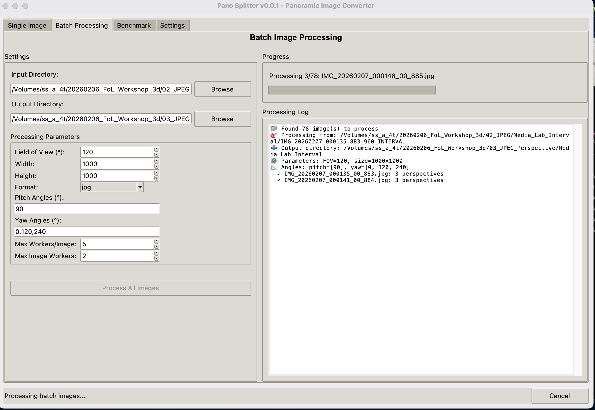

- **Field of View:** 120° — wider FOV to compensate for fewer views
- **Pitch Angles:** 90° — horizon only
- **Yaw Angles:** 0°, 120°, 240° — three directions around the horizon

This gives **3 perspective views per panorama**, or **234 images** for our 78 panoramas. Why the cutback? Polycam used to accept up to 2,000 images per upload, but now limits you to **300 images**. With 78 panoramas, 18 views each would blow past that limit. The wider 120° FOV helps make up for the reduced number of views — each crop covers more of the sphere.

### Polycam (Online Reconstruction)

Upload the 234 split perspective images to **[Polycam](https://poly.cam)**. Polycam handles COLMAP alignment internally — you just upload photos and get a model back. Free tier available.

**Photogrammetry (Mesh)** — traditional textured 3D mesh. More portable, works in any 3D software (Blender, Unity, Unreal, etc.).

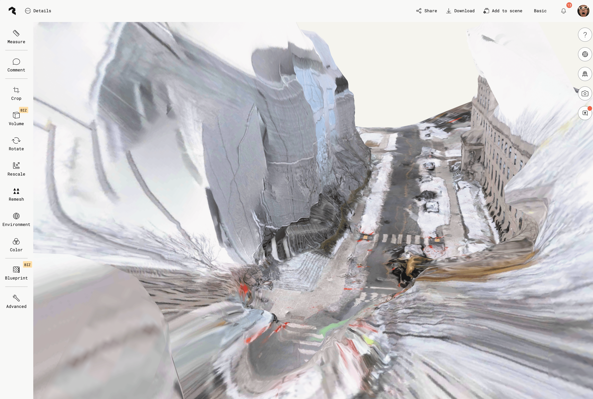

The mesh quality is noticeably rough — stretched textures, distorted geometry on buildings, and sparse detail overall. This is the trade-off of the compromise config: with only 3 perspective views per panorama (horizon-only, no upward or downward views), there simply isn't enough angular coverage for Polycam to reconstruct clean geometry. The 18-view config would produce significantly better results, but Polycam's 300-image limit forces the compromise. For higher-quality meshes from 360 photos, Metashape (Approach 1) or an offline tool like RealityCapture with the full 1,404-image set is the way to go.

**Gaussian Splat** — photorealistic, view-dependent rendering. Great for capturing lighting, reflections, and semi-transparent materials. Best viewed in a splat viewer.


### Other Reconstruction Tools

Once you have perspective views, you can also use:

**Gaussian Splatting:**

- **[Postshot](https://postshot.app/)** (Windows) — GUI-based gaussian splatting. Import photos, get a splat.
- **[gsplat](https://github.com/nerfstudio-project/gsplat) / [Nerfstudio](https://nerf.studio/)** (Python, cross-platform) — code-based pipelines. More control, more setup.

**Photogrammetry (Mesh / Point Cloud):**

- **[RealityCapture](https://www.capturingreality.com/)** (Windows, free via Epic Games) — fast, high-quality photogrammetry. Widely used in game dev and VFX.
- **[Agisoft Metashape](https://www.agisoft.com/)** (cross-platform, paid) — also works with perspective views if you don't want to use the spherical camera approach.

## Project References

### J Train Simulator


**[J Train Simulator](https://www.yufengzhao.com/)** is a gaussian splat 3D scan + soundscape of a J train stop in Brooklyn, NY. The entire scan was captured using 360° photos on a long selfie stick, shot from an apartment balcony. No drone was involved — just a consumer 360 camera on a very long stick, pointed down at the street below.

This demonstrates that 360 cameras can produce compelling 3D reconstructions even in situations where traditional capture methods (drones, walking around with a DSLR) aren't practical.

### Rhododendron Bush — Greenwood Cemetery, Brooklyn

<table>
<tr>
<td width="50%">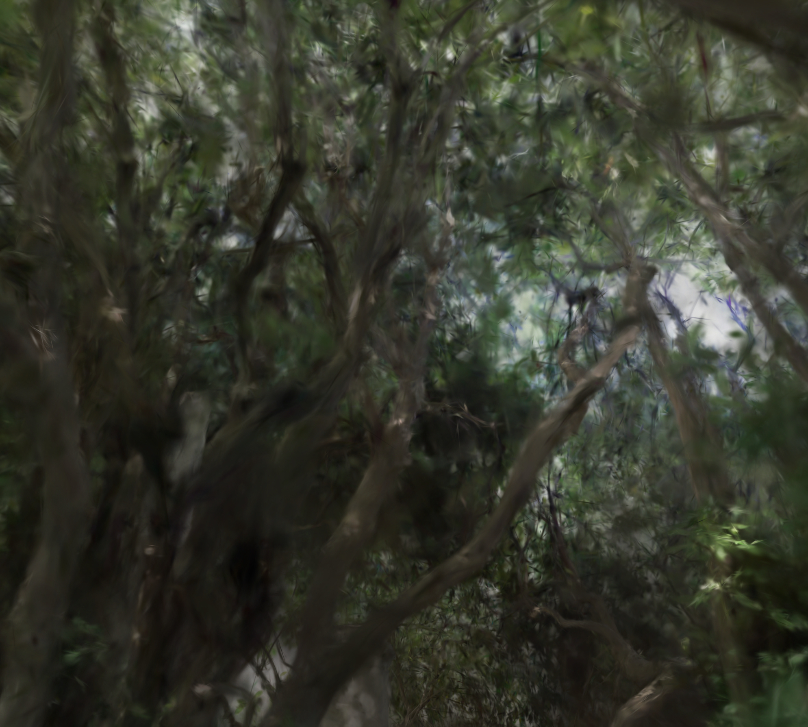</td>
<td width="50%">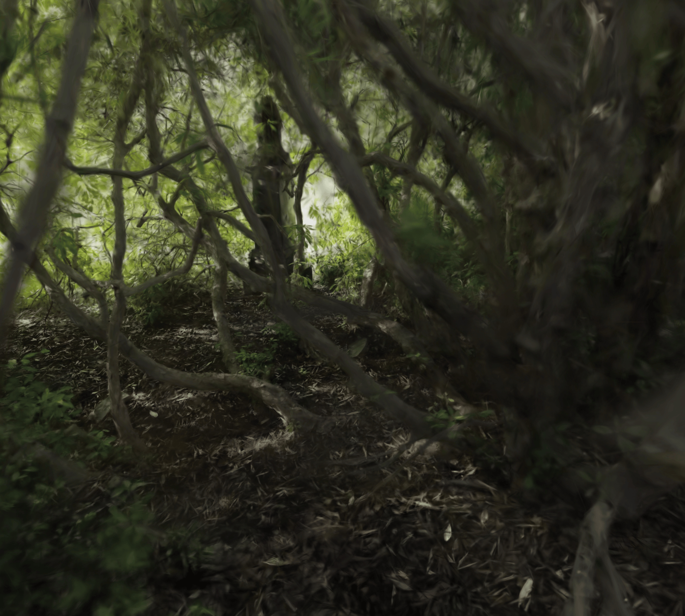</td>
</tr>
<tr>
<td align="center">Looking up through the canopy</td>
<td align="center">Interior ground and branch structure</td>
</tr>
</table>

A 3D gaussian splat scan of a remarkable **Catawba rhododendron** (_rhododendron catawbiense_) in [Greenwood Cemetery](https://www.green-wood.com/), Brooklyn. This almost two-story-tall arborescent shrub overshadows the nearby tombstones where Meadow Path meets Atlantic Avenue. Seen from outside it appears as a dense, impenetrable wall of leaves — but a small opening on the back reveals a spacious green chamber inside, big enough for several people to stand in.

The scan was captured with 360° photos and reconstructed as a gaussian splat, providing a way to digitally explore the interior structure of the bush that would be difficult to document with traditional photography alone. The dreamy, painterly quality of the splat — with its soft edges and light filtering through the canopy — suits the subject well.

This was part of a collaboration with artist [Ann Chen](https://www.cca.qc.ca/en/articles/101419/rhododendron-field-notes) for _Zomia Garden_, a project curated by 2023–2024 CCA Emerging Curator Yutong Lin that reflects on the ecology, landscape, and culture of the Himalayan-Hengduan Mountain region. Chen's essay traces the rhododendron's journey from the Himalayas to Brooklyn — how colonial-era botanical expeditions, plant migration, and anthropogenic climate change have shaped the plants we see around us.

---

**Previous:** [Chapter 0 — Capturing 360 Photos](../00-capturing-360/) · **Next:** [Chapter 2 — OCR on 360 Images](../02-ocr-360/)
