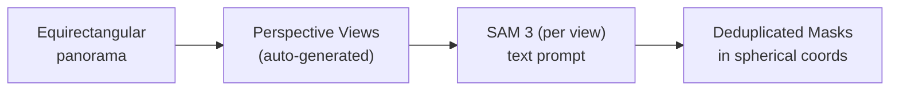

# Chapter 3: Object Segmentation on 360 Images

> Use **[PanoSAM](https://github.com/yz3440/panosam)** to detect and segment objects in panoramic images using text prompts, powered by Meta's SAM 3.

## What is PanoSAM?

**[PanoSAM](https://github.com/yz3440/panosam)** is a Python library that runs **[SAM 3](https://ai.meta.com/sam3/)** (Segment Anything Model 3) on equirectangular panorama images. It handles the full pipeline — perspective splitting, per-view segmentation, coordinate conversion back to spherical, and mask deduplication — in a single function call.

### What SAM 3 Brings

- **Text prompts** — describe objects with words: "car", "street sign", "window", "person"
- **Exemplar prompts** — draw a box around one example, and SAM 3 finds all similar objects
- **Visual prompts** — click on objects (like earlier SAM versions)

### What PanoSAM Adds

- **Automatic perspective splitting** with configurable presets (FOV, resolution, overlap)
- **Spherical coordinate conversion** — masks are returned in yaw/pitch degrees
- **Mask deduplication** — overlapping detections across views are merged automatically
- **Backend agnostic** — bring your own segmentation engine via a simple protocol
- **JSON export** compatible with the [interactive 3D preview tool](https://yz3440.github.io/panosam/)




## Installation

```bash
# Full install (SAM3 engine + visualization)
pip install "panosam[full]"

# Or just the SAM3 engine
pip install "panosam[sam3]"
```

SAM 3 requires HuggingFace authentication — accept the [model license](https://huggingface.co/facebook/sam3), then:

```bash
huggingface-cli login
```

**Note:** SAM 3 models are large and run best on a machine with a GPU. CPU inference is possible but slow.

## Quick Overview

```python
import panosam as ps
from panosam.engines.sam3 import SAM3Engine

engine = SAM3Engine()
client = ps.PanoSAM(engine=engine, views=ps.PerspectivePreset.DEFAULT)
result = client.segment("panorama.jpg", prompt="car")

for mask in result.masks:
    print(f"{mask.label}: yaw={mask.center_yaw:.1f}, pitch={mask.center_pitch:.1f}")

# Save for the interactive 3D preview tool
result.save_json("results.panosam.json")
```

See the **[PanoSAM documentation](https://yz3440.github.io/panosam/)** for full API reference and examples.

## Hands-On

See **[`segmentation_demo.py`](segmentation_demo.py)** for the walkthrough script.

The notebook walks through:
1. Loading an equirectangular panorama
2. Understanding PanoSAM's perspective presets
3. Running full-panorama segmentation with a text prompt
4. Visualizing spherical masks on the panorama
5. Exporting results for the interactive 3D preview tool

## Why This Matters for Panoramas

Imagine being able to say "find every fire hydrant" or "segment all text signs" across thousands of Google Street View panoramas. Combined with the tools from Chapter 4 (downloading GSV images programmatically), this opens up large-scale urban analysis, mapping, and creative data projects.

---

**Previous:** [Chapter 2 — OCR on 360 Images](../02-ocr-360/) · **Next:** [Chapter 4 — Found 360 Images](../04-found-360-images/)

---

## Suggested Assets to Add

| Filename | Description |
|----------|-------------|
| `assets/sam3-example.jpg` | Example of SAM 3 text-prompt segmentation on a perspective image |
| `assets/panorama-segmentation-result.jpg` | Segmentation masks overlaid on a panoramic view |
| `assets/sam3-panorama-pipeline.png` | Diagram showing the split → segment → collect pipeline |
