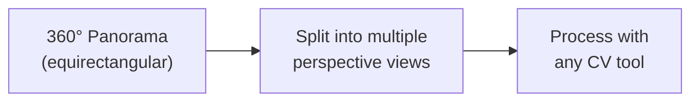

# How to Use Panorama in Almost Anything

> **MIT Media Lab — Festival of Learning**
> Friday, February 6, 2026 · 1:30–3:00 PM · E14-240
> Workshop Host: [Yufeng Zhao](https://www.yufengzhao.com/) · yufengz@mit.edu

---

## What This Workshop Covers

360° photos capture an entire scene in a single shot. But most computer vision tools — 3D reconstruction, OCR, object detection — expect regular flat (perspective) images. So how do you bridge that gap?

This workshop introduces a universal pattern that works across nearly every application:



This same approach powers 3D scanning, text recognition, object segmentation, and more — all from panoramic imagery.

We'll start by going outside to capture 360° photos with an Insta360 X4, then come back inside to process them in a variety of ways.

## Chapters

| #   | Chapter                                              | What You'll Learn                                                                                              |
| --- | ---------------------------------------------------- | -------------------------------------------------------------------------------------------------------------- |
| 0   | [Capturing 360 Photos](./00-capturing-360/)          | Going outside with an Insta360 X4, capture settings, and converting proprietary files to equirectangular JPEGs |
| 1   | [3D Scanning from 360](./01-3d-scanning/)            | Using panoramic images for photogrammetry and gaussian splatting                                               |
| 2   | [OCR on 360 Images](./02-ocr-360/)                   | Running text recognition on panoramas with PanoOCR                                                             |
| 3   | [Object Segmentation](./03-object-segmentation/)     | Using Meta's SAM 3 to detect and segment objects in panoramas via text prompts                                 |
| 4   | [Found 360 Images](./04-found-360-images/)           | Downloading and working with Google Street View panoramas programmatically                                     |
| 5   | [Creative Applications](./05-creative-applications/) | Artistic and experimental uses of panoramic imagery                                                            |

## Setup

### Prerequisites

- Python 3.10 or later
- [uv](https://docs.astral.sh/uv/) (recommended) or pip
- Jupyter Notebook or JupyterLab

### Install Dependencies

```bash
# Clone the repo
git clone https://github.com/yz3440/how-to-use-panorama-in-almost-anything.git
cd how-to-use-panorama-in-almost-anything

# Install dependencies
pip install -r requirements.txt
```

### Platform-Specific: OCR Engine

PanoOCR (Chapter 2) requires an OCR engine backend. Pick the one for your platform:

```bash
# macOS — Apple Vision Framework (fast, accurate, recommended)
pip install "panoocr[macocr]"

# Windows / Linux — PaddleOCR
pip install "panoocr[paddleocr]"
```

### Optional: SAM 3 (Chapter 3)

SAM 3 is a large model. GPU strongly recommended. Install separately:

```bash
pip install sam3
```

---

## About the Host

**[Yufeng Zhao](https://www.yufengzhao.com/)** is a media artist and technologist. His work addresses data, imagery and language processing, and experience design — exploring unexpected connections in our techno-cultural landscape and the interactions between humans and machines. Through web-based experiences, video works, and tangible installations, his practice investigates the intersections of data, computer graphics, and human interaction.

Currently a first-year graduate student and Research Assistant at the MIT Media Lab, [Future Sketches](https://www.media.mit.edu/groups/future-sketches/) group.

### Projects Referenced in This Workshop

- **[all text in nyc](https://alltext.nyc)** — A search engine and visualization tool for 138M+ text snippets OCR'd from 8M+ Google Street View panoramas across New York City, spanning 2007–2024. Press coverage in Fast Company, PCMag, Time Out, and The Pudding.
- **[diffused·city](https://diffused.city)** — A collection, generator, and geoguessr of fictional city panoramas, created by stitching panels generated with diffusion model inpainting (DALL-E 2 edit mode) into seamless 360° views.
- **[J Train Simulator](https://www.yufengzhao.com/)** — A 3D gaussian splat scan and soundscape captured near a J train stop in Brooklyn — shot entirely with 360° photos on a long selfie stick from an apartment balcony. No drone involved.

## License

MIT
